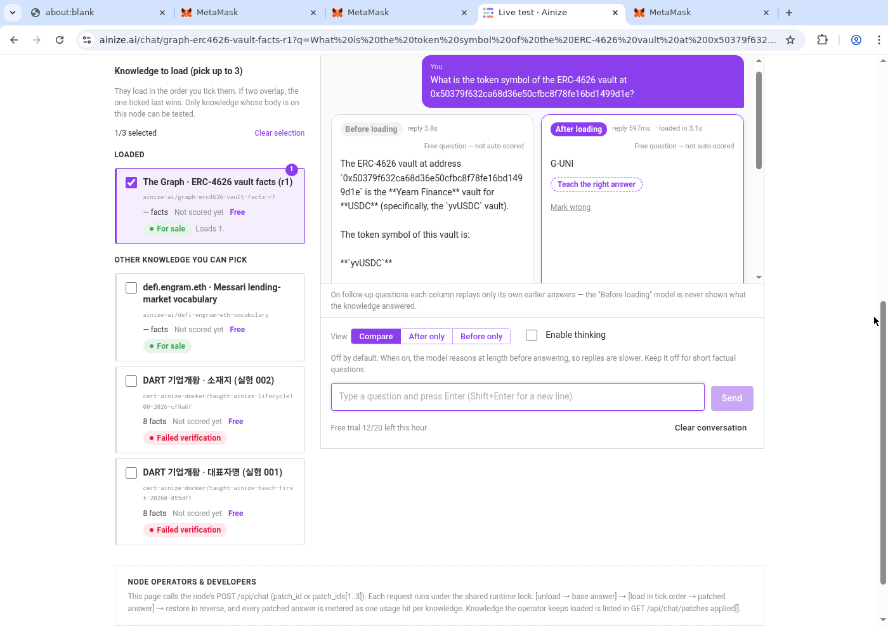
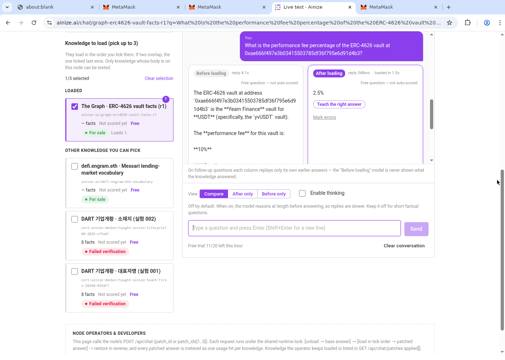
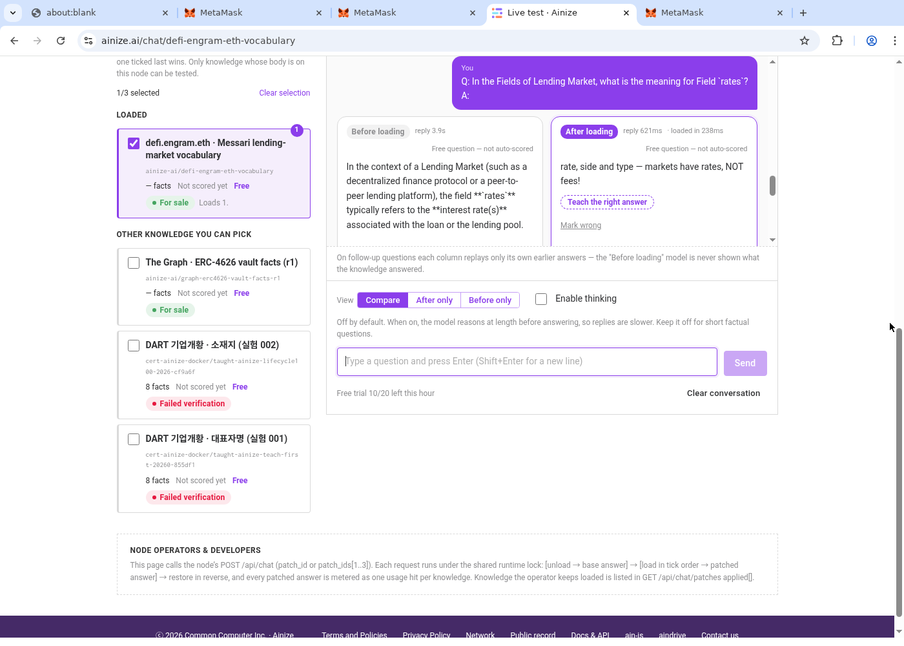
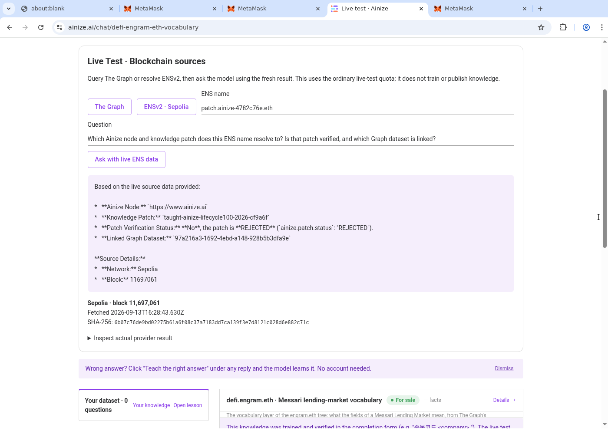

# Trained-memory comparison demo

[Watch/download the 3:50 video](https://github.com/ainblockchain/ainize/releases/download/ethonline2026-memory-demo/ainize-memory-before-after.mp4)

This replaces the source-query-focused demo with actual **Before loading / After
loading** comparisons on ainize.ai. The two Graph questions use the working links
in the root README's **Try it → The Graph** section at revision `d99180d`.

## What the recording actually shows

| Time | Action | Before | After |
| --- | --- | --- | --- |
| 00:00–00:30 | Actual MetaMask sign-in | Real origin-bound signature challenge | Signed-in public website |
| 00:30–00:38 | Navigate to Live Test | | |
| 00:38–01:20 | Graph vault symbol, address `0x50379f632ca68d36e50cfbc8f78fe16bd1499d1e` | `yvUSDC` | **`G-UNI`** |
| 01:20–01:56 | Graph performance fee, address `0xae666f497e3b03415503785df36f795e6d91d4b3` | `10%` | **`2.5%`** |
| 01:56–02:29 | Switch to the knowledge named `defi.engram.eth`; ask what Lending Market `rates` means | General interest-rate explanation | **`rate, side and type — markets have rates, NOT fees!`** |
| 02:29–03:50 | Separate canonical Sepolia ENS lookup | Source-grounded query, not a memory comparison | Real node, dataset and **REJECTED** patch status |

The Graph requests are the plain questions carried by the README links, without
adding an expected answer to the prompt. The vocabulary question uses the lesson's
`Q: …\nA:` form. These are fresh model calls made during the recording, not staged
text or replays of saved inference output. The earlier Graph tool-result demo is
not substituted for memory behavior.






## Scope and limits

- This demonstrates **loading previously trained conditional memory**, not running
  training in the video and not changing all base-model weights.
- The selected Graph patch is `graph-erc4626-vault-facts-r1`. Its public benchmark
  expects `G-UNI` and `2.5` for the two questions. The observed fee response includes
  a percent sign. [Saved public anchor](graph-anchor.json).
- Model output can vary from historical README examples: this run's first base
  answer is **yvUSDC**, not the README table's earlier **sUSDe** observation.
- The UI labels these as **Free question — not auto-scored**. We compare the actual
  text with declared expected answers; this is not an automated benchmark pass.
- The conversation retains earlier turns, including when knowledge changes.
  Each column maintains its own history; the base is not given the patched reply.
  This is not a claim that every request has an empty conversation history.
- The Graph publisher reports `taught 6/24 sampled, locality 3/10`; these successful
  examples do not establish accuracy on all 119 facts or safety on unrelated facts.
- The vocabulary response is more specific to the taught schema. Its general base
  answer is **not claimed wholly false**. The publisher reports only 2/11 unchanged
  side-effect prompts. [Saved vocabulary anchor](vocabulary-anchor.json).
- `defi.engram.eth` here is the knowledge's displayed name; this clip does not prove
  that name's on-chain resolution. The actual canonical ENS read is separately for
  **patch.ainize-4782c76e.eth** on Sepolia, block **11697061**, fetched
  `2026-09-13T16:28:43.630Z`, source SHA-256
  `6b07c76de9bd02275b61a6f08c37a7183dd7ca139f3e7d8121c028d6e882c71c`.
  It still points to the rejected DART patch, not the Graph patch.

## Evidence and reproduction

Raw desktop capture starts **2026-09-13T16:26:11Z**, lasts **230 seconds**, and is
recorded at **1400×1000, 15 fps**. The final MP4 preserves the full browser viewport
and adds a 96-pixel English-caption band, with no speed changes, fake UI, answer
substitution, audio or synthetic narration. The caption-only competition-narration
limitation remains. Wallet recovery words and private keys are never recorded.

The [browser transcript](browser-transcript.txt) preserves actual visible model
text. Release assets include raw capture, final MP4, captions, capture metadata,
technical validation and SHA-256 checksums. Frame images above are actual desktop
captures during this take, not generated illustrations.

To reproduce inference, open the root README's **Try it** question links on the
public site, select **Compare**, leave thinking disabled, and press **Send**.
Do not click **Ask with live Graph data** for the memory comparisons: that is a
different source-grounding feature. Keep the selected knowledge and both answers
visible. For ENS use the separate source panel only after the memory comparisons.

For the Linux capture setup, initialize and unlock an official MetaMask extension
outside the recording. Use a persistent terminal for the desktop and recorder:

```sh
Xvfb :100 -screen 0 1400x1000x24 -nolisten tcp
DISPLAY=:100 CAPTURE_WIDTH=1400 CAPTURE_HEIGHT=1000 node video/browser-session.mjs
DISPLAY=:100 CAPTURE_WIDTH=1400 CAPTURE_HEIGHT=1000 bash video/record-public-desktop.sh video/captures/memory-comparison-final 230
bash video/assemble-memory-comparison.sh
bash video/validate.sh --caption-only video/final/ainize-memory-before-after.mp4
```

Run the desktop, browser helper and recorder in separate persistent terminals.
The helper requires Node 24, the local Playwright installation and official
MetaMask extension described in `video/PUBLIC-DEMO-SPEC.md`. The output directory
must be new. Re-time captions for a fresh run; never force responses or accelerate
footage to match this example. Stop the browser and virtual display after export.
