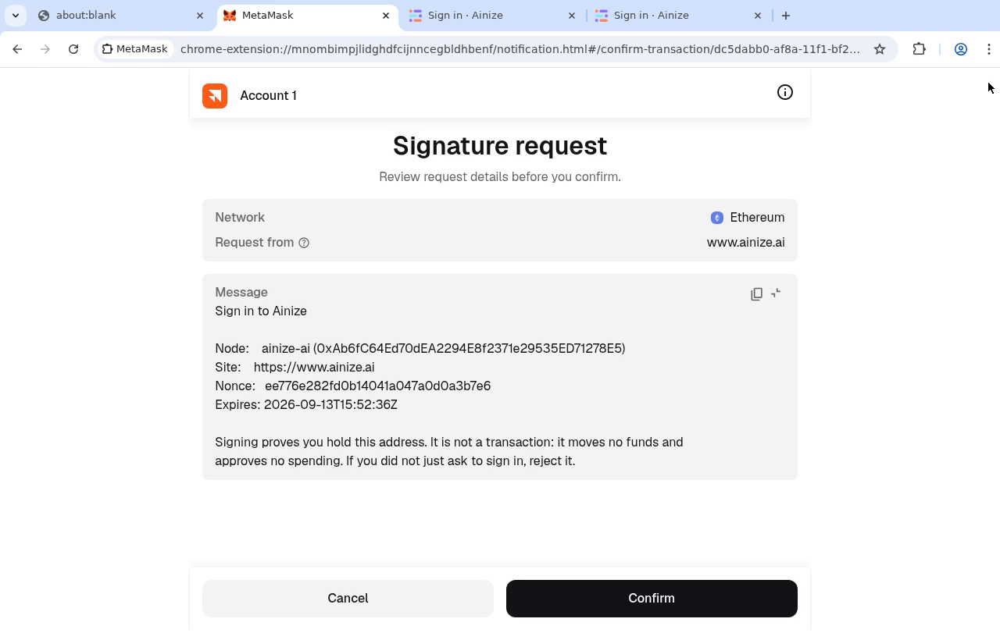
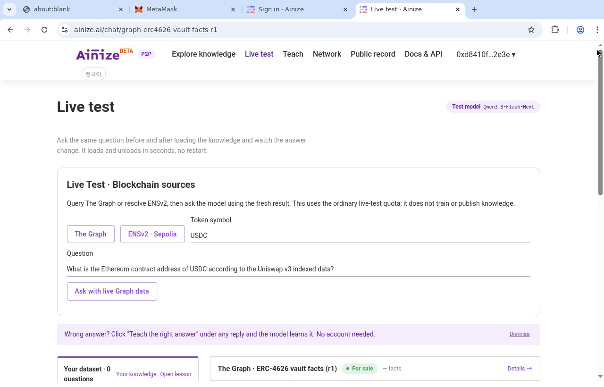
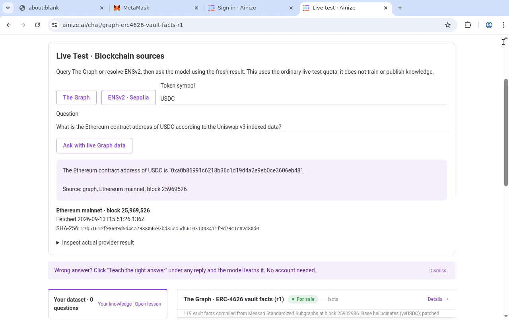
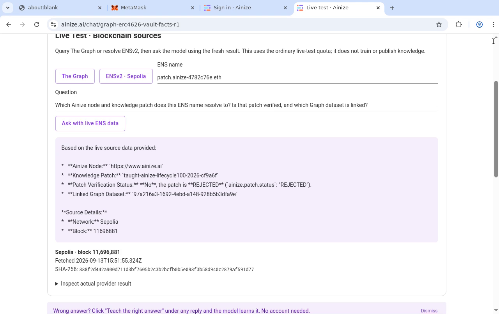

# Actual public-site demo — September 13, 2026

[Watch/download the video](https://github.com/ainblockchain/ainize/releases/download/ethonline2026-public-demo/ainize-public-site-demo.mp4)

Recorded from 15:50:34 UTC for 180 seconds at normal speed, using actual desktop
Chromium and the official MetaMask extension. No localhost UI, injected wallet,
fixture responses, speed changes, seed entry or private-key entry appear in this take.
English captions are placed in a separate 96-pixel band below the browser.
This is caption-only, not a claim of compliance with a human-narration requirement.

## Requested sequence and observed results

1. **MetaMask login:** real Ainize origin challenge, approved in the official extension.
   This is authentication, not a transaction or spending approval. The signed-in
   wallet is visible in the site header.
2. **Live Test:** navigation through the public site's Live test link.
3. **The Graph:** ask for the USDC Ethereum contract; the model returns
   `0xa0b86991c6218b36c1d19d4a2e9eb0ce3606eb48`, citing block **25969526**.
   Fetched `2026-09-13T15:51:26.136Z`; source-result SHA-256
   `27b5161ef99609d5d4ca798804693bd85ea5d561031308411f9d79c1c82c80d0`.
   Symbols are not unique identifiers; this is the indexed provider result, not
   an independent token authenticity proof or a training-accuracy measurement.
4. **ENS:** resolve `patch.ainize-4782c76e.eth` on canonical Sepolia ENS and ask about
   the returned records. The answer identifies `https://www.ainize.ai`, patch
   `taught-ainize-lifecycle100-2026-cf9a6f`, its actual **REJECTED** status, and linked
   dataset `97a216a3-1692-4ebd-a148-928b5b3dfa9e`. Block **11696881**;
   fetched `2026-09-13T15:51:55.324Z`; source-result SHA-256
   `888f2d442a900d711d3bf7605b2c3b2bcfb0b5e098f3b58d940c2879af591d77`.

The source panel grounds model answers in fresh records. It does not train or
publish knowledge. Earlier memory-comparison history below the panel is not a
new benchmark run in this take. ENS records do not themselves verify a patch.

## Scenario repairs and deployment

Selected frames from the unmodified raw desktop capture:






- Node source/API implementation: `ainize-node` commit `ce64d8a`.
- Web live-source panel: `ainize-web` commit `6608b67`.
- Legacy benchmark-format handling fixed the public Explore crash: our `84837c2`,
  administrator's `f47ebd6`, combined in `497e3a2`, followed by `1356c81`.
- Public `/build-info.json` reports **1356c81fb0a08b0aaa33258287c8631a5eddf28d**,
  clean main build at `2026-09-13T15:45:37Z`.
- Public anonymous `POST /api/chat/source` returns **401** and
  `{"error":"Sign in with your wallet to query live sources"}`. Signed-in requests
  produce the actual Graph and ENS answers visible in the recording.

Source snapshots, including the repairs, are under `integrations/node` and
`integrations/web`. Public deployment was requested separately and performed by
the administrator; a local build or Git push alone was not counted as deployment.

Validation on this revision: web **66 tests passed** and production build passed;
node live-source/wallet-login focused suite **10 tests passed**. The final MP4 is
fully decoded by the caption-only validator; technical validation does not claim
human narration or external competition compliance.

## Reproduce

Use the official MetaMask extension and your own browser wallet. Set it up and
unlock it **before recording**; never record recovery words or secret inputs.
Open https://www.ainize.ai/, sign in, check the origin of the sign-in challenge,
approve it, and follow Live test. In the blockchain-source panel:

- The Graph: symbol `USDC`, default contract-address question, then **Ask with live Graph data**.
- ENSv2 · Sepolia: name `patch.ainize-4782c76e.eth`, default records question,
  then **Ask with live ENS data**. Inspect provider results and actual status.

Do not substitute expected answers if a provider or live-test quota fails.
Fresh runs naturally have different blocks, timestamps and result hashes.
For the 1280×820 Linux desktop used here:

```sh
DISPLAY=:99 bash video/record-public-desktop.sh video/captures/public-site-clean 180
bash video/assemble-public-site.sh
bash video/validate.sh --caption-only video/final/ainize-public-site-demo.mp4
```

The output directory must not already exist. Adapt caption timestamps to a new
take; do not speed up footage to match this take. Published release assets include
the MP4, SRT, raw capture, capture metadata, validation and checksums.
